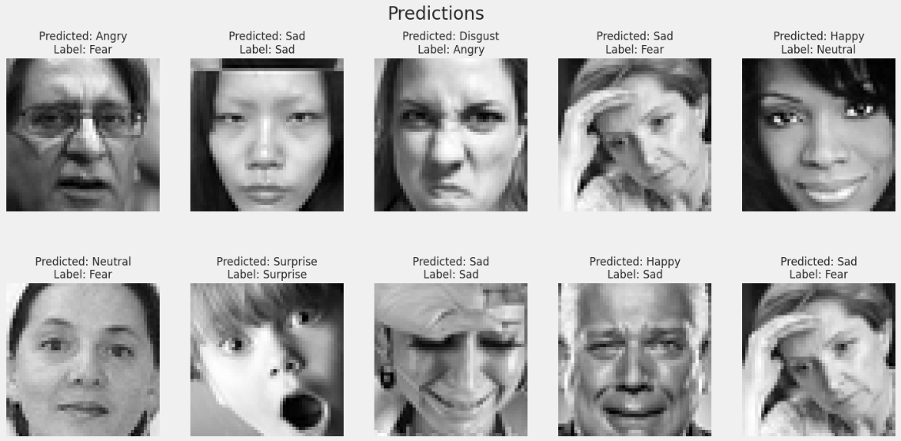

# FacialEmotionRecognition

Computer Vision Project: This repository contains code for a facial emotion recognition system based on the FER2018 dataset from Kaggle. The FER2018 dataset consists of 35,887 grayscale images of faces, each labeled with one of seven emotions: anger, disgust, fear, happiness, sadness, surprise, or neutral.

## Contents
<!-- list -->

* [Introduction](#introduction)
* [Dataset](#dataset)
* [Model](#model)
* [Code Sturcture](#code-structure)
* [Results](#results)
* [How to Run](#how-to-run)
* [References](#references)

<!-- listend -->

## Introduction
<!-- introduction -->
Facial emotion recognition is the process of detecting human emotions from facial expressions. This is a popular topic in both computer vision and psychology. The ability to read facial expressions is an important part of nonverbal communication. In this project, we will build a facial emotion recognition system that can be used in real-world applications. We will use the FER2018 dataset from Kaggle, which consists of 35,887 grayscale images of faces, each labeled with one of seven emotions: anger, disgust, fear, happiness, sadness, surprise, or neutral. We will use a convolutional neural network (CNN) to classify images of faces into one of the seven emotions. We will then build a face detection model that can detect faces in real time using a webcam. Finally, we will combine the emotion classification and face detection models to create a live emotion detection system.

<!-- introductionend -->

## Dataset
<!-- dataset -->
The dataset we will use is the FER2018 dataset from Kaggle. The dataset consists of 35,887 grayscale images of faces, each labeled with one of seven emotions: anger, disgust, fear, happiness, sadness, surprise, or neutral. The dataset contains both training and test sets. The training set consists of 28,709 examples, and the test set consists of 3,589 examples. The dataset is available on Kaggle at https://www.kaggle.com/datasets/ashishpatel26/fer2018.

## Model
<!-- model -->
I have used ResNet-34 model for this project. ResNet-34 is a convolutional neural network that is 34 layers deep. You can load a pretrained version of the network trained on more than a million images from the ImageNet database. The pretrained network can classify images into 1000 object categories, such as keyboard, mouse, pencil, and many animals. As a result, the network has learned rich feature representations for a wide range of images. The network has an image input size of 224-by-224. This is the input size required for the network. To classify an image using the pretrained ResNet-34 model, resize the image to [224 224] and subtract the average image of the ImageNet data set.
The options for the ResNet models are:
<!-- list -->
* [ResNet-18](https://www.mathworks.com/help/deeplearning/ref/resnet18.html)
* [ResNet-34](https://www.mathworks.com/help/deeplearning/ref/resnet34.html)
* [ResNet-50](https://www.mathworks.com/help/deeplearning/ref/resnet50.html)
* [ResNet-101](https://www.mathworks.com/help/deeplearning/ref/resnet101.html)
<!-- listend -->

## Code Structure
<!-- code structure -->
    FacialEmotionRecognition/
    ├── data/
    │   ├── fer2018.bib
    │   ├── fer2018.csv
    │   ├── ferSubmissions.csv
    │   └── README.md
    ├── dependencies.py
    ├── hyperparameters.py
    ├── models.py
    ├── main.py
    ├── predict.py
    ├── utils.py
    └── README.md

<!-- code structureend -->

## Results
<!-- results -->


<!-- resultsend -->

## How to Run
<!-- how to run -->
1. Clone the repository
```bash
git clone https://github.com/Vincit0re/FacialEmotionRecognition.git
```
2. Install the dependencies
```bash
pip install -r requirements.txt
```
3. Run the main.py file
```bash
Available options:

-- model_name: name of the model
-- lr: learning rate
-- weight_decay: weight decay
-- num_epochs: number of epochs
-- num_classes: number of classes
-- print_every: logging results frequency
-- batch_size: batch size
-- shuffle: whether to shuffle data
-- debug: debug mode
-- save_path: path to save the model
-- num_workers: number of workers
```
<!-- listend -->

```bash
Example Run:

python main.py --lr 0.001 --model_name resnet18 --save_path models/resnet18.pth
```

4. Run the predict.py file
```bash
python predict.py --model_path models/resnet18.pth --img_path data/test/0.jpg
```
<!-- how to runend -->

## References
<!-- references -->
* [FER2018 Dataset](https://www.kaggle.com/datasets/ashishpatel26/fer2018)
<!-- referencesend -->

## License
```
 "Challenges in Representation Learning: A report on three machine learning
contests." I Goodfellow, D Erhan, PL Carrier, A Courville, M Mirza, B
Hamner, W Cukierski, Y Tang, DH Lee, Y Zhou, C Ramaiah, F Feng, R Li,
X Wang, D Athanasakis, J Shawe-Taylor, M Milakov, J Park, R Ionescu,
M Popescu, C Grozea, J Bergstra, J Xie, L Romaszko, B Xu, Z Chuang, and
Y. Bengio. arXiv 2013.
```